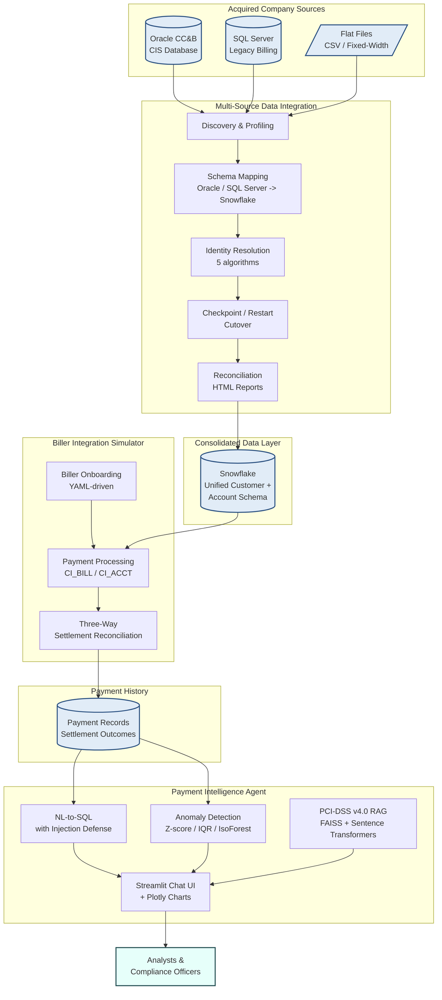

# GenAI Portfolio - Architecture

Author: Ravi Potluru

This document describes the shared architectural philosophy across the three projects in the GenAI portfolio, how they would integrate in a realistic enterprise deployment, and the rationale behind the cross-cutting choices that show up in every project.

---

## 1. Shared Philosophy

Although each project solves a different problem, they were built against the same set of principles. If you have read one project's source, the conventions in the others should feel familiar within minutes.

### 1.1 YAML-driven configuration

Every project externalizes operational knobs into YAML rather than burying them in Python.

- **Biller Integration Simulator** -- Biller fee schedules, settlement rules, and onboarding validation thresholds live in `config/billers.yaml`. Adding a new biller is a config change, not a code change.
- **Payment Intelligence Agent** -- Anomaly detector parameters (Z-score thresholds, IQR multipliers, isolation-forest contamination), RAG retrieval depth, and embedding model identifiers live in `config/agent.yaml`.
- **Multi-Source Data Integration** -- Source-to-target schema mappings, identity-resolution algorithm weights, and reconciliation tolerance levels live in declarative YAML.

The rule: **anything an operator might reasonably want to tune in production goes in YAML.** Code paths consume validated configuration objects, never raw dicts, so type errors surface at load time rather than at runtime.

### 1.2 Structured logging with `structlog`

All three projects emit structured logs using `structlog`. Every log line is a key-value record that downstream tools (Datadog, Splunk, ELK) can index without regex.

```python
log.info("payment.settled",
         biller_id=biller.id,
         payment_id=payment.id,
         amount_cents=amount_cents,
         elapsed_ms=elapsed_ms)
```

This is the same pattern across all three codebases. Operators get consistent telemetry regardless of which subsystem they are debugging.

### 1.3 Demo-mode-first design

Each project runs end-to-end with **zero external dependencies** in demo mode -- no live database, no cloud account, no API keys.

- The **Biller Integration Simulator** seeds an in-memory CC&B-style schema and exercises the full payment lifecycle without Oracle.
- The **Payment Intelligence Agent** ships a synthetic payment dataset and a pre-built FAISS index of PCI-DSS v4.0 documents, so the chat UI works immediately after `pip install`.
- The **Multi-Source Data Integration Framework** generates synthetic source data and writes Snowflake-compatible artifacts to local files, so the migration pipeline can be exercised end-to-end without Snowflake credentials.

This is deliberate: a portfolio reviewer should be able to clone, install, and see the system work in under five minutes. Production wiring (real Snowflake, real Oracle, real PCI-DSS corpus) is layered on top via configuration.

### 1.4 `pytest`-driven quality bar

Every project uses `pytest` with the same conventions:

- 80%+ line coverage target
- Deterministic tests (fixed seeds, no clock dependencies, no network)
- Markers (`unit`, `integration`, `slow`) for selective runs
- Realistic fixture data shapes that mirror production schemas

**Total: 240 tests across the portfolio.** All run in CI on every PR.

---

## 2. How the Three Projects Relate

The three projects are independently useful, but they were not chosen at random -- each sits at a distinct point in a typical enterprise payment / data ecosystem, and together they form a coherent stack.

| Project | Layer | Role in a real deployment |
|---|---|---|
| Multi-Source Data Integration | Ingest / Migration | Brings data from acquired company sources into the corporate Snowflake warehouse |
| Biller Integration Simulator | Operational Processing | Generates and processes payment transactions against utility billing data |
| Payment Intelligence Agent | Analytics / Decision Support | Provides conversational analytics over the consolidated payment history |

Read top-to-bottom, this is the lifecycle of a record in an enterprise that grows by acquisition: data is **acquired**, **transacted against**, and **analyzed**. The portfolio demonstrates each phase with a working system.

### 2.1 Combined architecture diagram



### 2.2 Walking the flow

1. **Acquisition.** A utility company is acquired. Their customer records live in Oracle CC&B; their legacy billing data lives in SQL Server; some peripheral data arrives as flat files.
2. **Ingest.** The **Multi-Source Data Integration Framework** discovers and profiles the sources, applies declarative schema mappings to a unified Snowflake target, runs identity resolution to deduplicate customers across the acquired entity and the existing customer base, and produces reconciliation reports proving the migration was lossless.
3. **Operational use.** The **Biller Integration Simulator** runs against the consolidated Snowflake data. New billers are onboarded via YAML, payments are processed against `CI_ACCT` / `CI_BILL` records, and three-way settlement reconciliation confirms platform / biller / bank agreement.
4. **Analytics.** Settled payment records flow into a payment history store. The **Payment Intelligence Agent** sits on top, offering analysts an NL-to-SQL chat experience over the data, statistical anomaly detection for fraud or system-error triage, and PCI-DSS v4.0-grounded compliance Q&A via RAG.

In a real deployment these would be three deployable services with well-defined contracts. The portfolio implements each one as a self-contained system with realistic data shapes so the seams are visible.

---

## 3. Cross-Cutting Concerns

### 3.1 Observability

- **Logs.** `structlog` with JSON output in production, console-pretty output in development. Every log includes a correlation identifier passed through the call stack.
- **Metrics.** Each project exposes timing on its critical operations (settlement run, migration cutover, anomaly scan). Hooks are designed to feed Prometheus or StatsD without code changes.
- **Tracing.** Spans are emitted at major boundaries (config load, batch start/end, external call); the implementation is currently log-based but is structured so an OpenTelemetry exporter could be dropped in.

### 3.2 Error handling

- **Validated configuration at load time.** Bad YAML fails fast at startup, not at the moment a malformed value is first read.
- **Domain-specific exceptions.** Each project defines a small exception hierarchy (e.g. `SettlementMismatchError`, `IdentityResolutionAmbiguityError`). Generic `Exception` catches are reserved for top-level boundaries.
- **Retries are explicit.** Where transient errors are expected, retry logic is configurable in YAML (max attempts, backoff base) rather than hardcoded.
- **Partial-progress preservation.** Long-running jobs (the migration pipeline in particular) checkpoint after each completed phase so failures restart from the last good state instead of rerunning the whole job.

### 3.3 Security

- **No hardcoded credentials.** All secrets come from environment variables or a secret manager interface; YAML configs reference key names, not values.
- **SQL injection defense.** The Payment Intelligence Agent's NL-to-SQL layer parses generated SQL, rejects multi-statement queries, allow-lists table and column names against a known schema, and rejects DDL/DML.
- **PII handling.** The migration framework supports column-level masking rules in YAML so PII columns can be hashed or tokenized at landing.
- **PCI-DSS awareness.** The compliance RAG corpus is grounded in PCI-DSS v4.0; the simulator's settlement code paths avoid storing PAN data in cleartext at any boundary.

### 3.4 Testing strategy

| Test type | Marker | When to run | Where it lives |
|---|---|---|---|
| Unit | `@pytest.mark.unit` (default) | Every commit, every CI run | `tests/unit/` |
| Integration | `@pytest.mark.integration` | Every CI run | `tests/integration/` |
| Slow | `@pytest.mark.slow` | Nightly / on demand (`pytest -m slow`) | Anywhere |

Coverage is measured per project with `pytest-cov`. CI fails if any project drops below the configured floor.

---

## 4. Tech Stack Rationale

Each major dependency was chosen deliberately. Where there were obvious alternatives, the reasoning is below.

### Python 3.11

- Faster startup and runtime than 3.10, with usable error messages.
- Native `tomllib`, `Self` type, exception groups -- all useful for the kind of orchestration code these projects involve.

### `pytest` (over `unittest`)

- Function-style tests are shorter and more readable than `TestCase` subclasses.
- Fixtures compose cleanly across modules.
- Rich plugin ecosystem (`pytest-cov`, `pytest-xdist`, `pytest-mock`).
- Better failure diffs out of the box.

### `structlog` (over stdlib `logging`)

- Native key-value logging instead of f-string formatting -- log records are real records, not strings.
- Easy to switch between human-readable console output and JSON for production with one config line.
- Composable processors mean we can add request IDs, redact PII, or change output format without touching call sites.

### `pyyaml` for configuration

- Human-friendly to edit and review in PRs.
- Supports comments, which TOML and JSON do not -- important for production config.
- Universally familiar to Ops engineers.

### `pandas` and `NumPy` for data manipulation

- The migration framework and analytics agent both work with tabular data; pandas is the right tool.
- NumPy supplies the numerical primitives the anomaly detectors rely on.

### FAISS (over Pinecone, Weaviate, Chroma) for the PCI-DSS RAG store

- Local, in-memory, no external service. Fits the demo-mode-first principle.
- Fast enough for the corpus size (PCI-DSS v4.0 is ~360 pages).
- Index can be rebuilt deterministically from a fixed corpus + fixed embedding model, which makes tests reproducible.

### `sentence-transformers` for embeddings

- High-quality embeddings without an external API call.
- The `all-MiniLM-L6-v2` model is small enough to ship in a container image and fast enough on CPU.

### Streamlit for the analyst UI

- Fastest way to ship a data-science-flavored chat UI without writing JavaScript.
- Plotly integration is first-class, which matters for the chart-on-result pattern.
- Trade-off accepted: not appropriate for high-concurrency production. For a real deployment, the same backend would sit behind a React + FastAPI front end.

### `Jinja2` for reconciliation reports

- Familiar templating language for HTML output.
- Same templates are reusable for email digests if a notification channel is added later.

### GitHub Actions for CI

- Native to where the code lives.
- Matrix builds make the per-project test runs trivial to express.
- Cache-friendly, which keeps PR feedback under five minutes.

### Snowflake as the warehouse target

- Industry-standard cloud warehouse for the kind of analytics workload the agent is built for.
- Strong support for semi-structured data (`VARIANT`), which matters for ingesting heterogeneous source schemas.
- Cortex (used by the Payment Intelligence Agent in production mode) brings LLM capabilities close to the data.

---

## 5. Where to Read Next

- **`README.md`** -- portfolio overview and quick-start.
- **`CONTRIBUTING.md`** -- how to set up a dev environment and add a new project.
- **Each project's `README.md`** -- system-specific architecture details.
- **Each project's `docs/`** -- ADRs and deeper dives.
