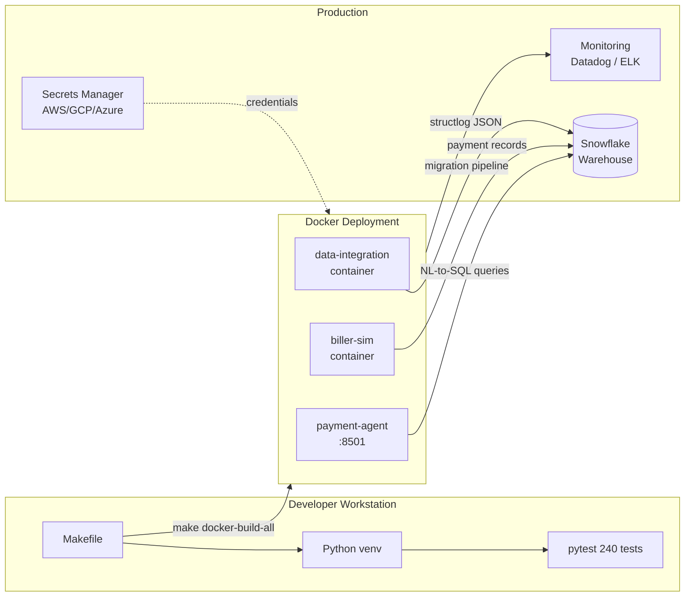

# Deployment Guide

Author: Ravi Potluru

This guide covers how to deploy the three GenAI Portfolio projects -- from local development through production. The projects are independently deployable but designed to work together as an integrated data pipeline.

---

## Table of Contents

1. [Prerequisites](#prerequisites)
2. [Architecture Overview](#architecture-overview)
3. [Local Development](#local-development)
4. [Docker Deployment](#docker-deployment)
5. [Production Deployment](#production-deployment)
6. [CI/CD Pipeline](#cicd-pipeline)
7. [Monitoring & Observability](#monitoring--observability)
8. [Troubleshooting](#troubleshooting)

---

## Prerequisites

| Requirement | Version | Purpose |
|---|---|---|
| Python | 3.11+ | Runtime for all projects |
| pip | 23.0+ | Package management |
| Docker | 24+ | Containerized deployment |
| Docker Compose | v2+ | Multi-container orchestration |
| GNU Make | 3.81+ | Build automation |
| Git | 2.40+ | Version control |
| Snowflake Account | -- | Production data warehouse (optional for demo mode) |

---

## Architecture Overview



### Service Integration Flow

The three projects integrate in the following order during a typical enterprise deployment:

1. **Multi-Source Data Integration** ingests data from acquired sources (Oracle, SQL Server, flat files) into Snowflake
2. **Biller Integration Simulator** processes payments against the consolidated data in Snowflake
3. **Payment Intelligence Agent** provides analytics and compliance queries over the payment history

---

## Local Development

### Quick Setup

```bash
cd genai-portfolio

# Create a virtual environment
python3.11 -m venv .venv
source .venv/bin/activate

# Install all dependencies
make install

# Run all 240 tests
make test

# Run with coverage
make coverage
```

### Per-Project Development

```bash
# Work on a single project
cd biller-integration-simulator
pip install -r requirements.txt
pip install -e .
python -m pytest tests/ -v

# Run the demo
bash quickstart.sh
```

### Pre-Commit Hooks

```bash
# Install pre-commit hooks (runs black, isort, ruff, mypy on every commit)
make pre-commit-install

# Run hooks manually against all files
make pre-commit-run
```

### Code Quality

```bash
make lint       # flake8
make format     # black + isort
make clean      # remove __pycache__, .pytest_cache, output/
```

---

## Docker Deployment

### Building Images

Each project has a multi-stage Dockerfile that produces a minimal image with a non-root `appuser` (UID 1000).

```bash
# Build all three images
make docker-build-all

# Or build individually
docker build -t genai-portfolio/biller-integration-simulator:latest biller-integration-simulator/
docker build -t genai-portfolio/payment-intelligence-agent:latest payment-intelligence-agent/
docker build -t genai-portfolio/multi-source-data-integration:latest multi-source-data-integration/
```

### Running with Docker Compose

```bash
# Start all services
make docker-up

# Or start a specific project
cd payment-intelligence-agent
docker compose up -d

# Verify health
docker compose ps
curl http://localhost:8501/_stcore/health

# Stop all services
make docker-down
```

### Environment Configuration

Each project includes a `.env.example` file. Copy it to `.env` and configure:

```bash
cp .env.example .env
# Edit .env with your settings
```

**Biller Integration Simulator:**
```env
LOG_LEVEL=INFO
DEMO_MODE=true
OUTPUT_DIR=output
```

**Payment Intelligence Agent:**
```env
DEMO_MODE=true
EMBEDDING_MODEL=all-MiniLM-L6-v2
LOG_LEVEL=INFO
# Production Snowflake settings (not needed for demo)
# SNOWFLAKE_ACCOUNT=your_account
# SNOWFLAKE_USER=your_user
# SNOWFLAKE_PASSWORD=your_password
# SNOWFLAKE_WAREHOUSE=COMPUTE_WH
# SNOWFLAKE_DATABASE=PAYMENT_ANALYTICS
# SNOWFLAKE_SCHEMA=PUBLIC
```

**Multi-Source Data Integration:**
```env
LOG_LEVEL=INFO
DEMO_MODE=true
OUTPUT_DIR=output
# SNOWFLAKE_ACCOUNT=your_account
```

### Volume Mounts

Configuration files are mounted as volumes so they can be edited without rebuilding:

```yaml
volumes:
  - ./config:/app/config:ro
```

### Health Checks

| Service | Endpoint | Interval |
|---|---|---|
| Payment Intelligence Agent (Streamlit) | `http://localhost:8501/_stcore/health` | 30s |
| Biller Integration Simulator | Process exit code | on-run |
| Multi-Source Data Integration | Process exit code | on-run |

---

## Production Deployment

### Secrets Management

Never store secrets in `.env` files or YAML configs in production. Use a secrets manager:

```bash
# AWS Secrets Manager
aws secretsmanager create-secret \
  --name genai-portfolio/snowflake \
  --secret-string '{"account":"xy12345","user":"svc_genai","password":"..."}'

# GCP Secret Manager
gcloud secrets create snowflake-creds --data-file=creds.json

# Azure Key Vault
az keyvault secret set --vault-name genai-vault \
  --name snowflake-account --value "xy12345"
```

In Docker, inject secrets as environment variables:

```yaml
services:
  payment-agent:
    environment:
      - SNOWFLAKE_ACCOUNT=${SNOWFLAKE_ACCOUNT}
      - SNOWFLAKE_USER=${SNOWFLAKE_USER}
    secrets:
      - snowflake_password
```

### Snowflake Configuration

#### Warehouse Setup

```sql
-- Create dedicated warehouses for each workload
CREATE WAREHOUSE IF NOT EXISTS MIGRATION_WH
  WAREHOUSE_SIZE = 'MEDIUM'
  AUTO_SUSPEND = 300
  AUTO_RESUME = TRUE;

CREATE WAREHOUSE IF NOT EXISTS PAYMENT_WH
  WAREHOUSE_SIZE = 'SMALL'
  AUTO_SUSPEND = 300
  AUTO_RESUME = TRUE;

CREATE WAREHOUSE IF NOT EXISTS ANALYTICS_WH
  WAREHOUSE_SIZE = 'SMALL'
  AUTO_SUSPEND = 60
  AUTO_RESUME = TRUE;
```

#### Database and Schema

```sql
-- Shared database for all three services
CREATE DATABASE IF NOT EXISTS ENTERPRISE_DATA;

CREATE SCHEMA IF NOT EXISTS ENTERPRISE_DATA.MIGRATION;    -- Multi-Source Data Integration
CREATE SCHEMA IF NOT EXISTS ENTERPRISE_DATA.BILLING;      -- Biller Integration Simulator
CREATE SCHEMA IF NOT EXISTS ENTERPRISE_DATA.ANALYTICS;    -- Payment Intelligence Agent
```

#### Service Roles

```sql
-- Least-privilege roles for each service
CREATE ROLE IF NOT EXISTS ROLE_MIGRATION;
CREATE ROLE IF NOT EXISTS ROLE_BILLING;
CREATE ROLE IF NOT EXISTS ROLE_ANALYTICS;

-- Migration role needs write access to land data
GRANT USAGE ON WAREHOUSE MIGRATION_WH TO ROLE ROLE_MIGRATION;
GRANT ALL ON SCHEMA ENTERPRISE_DATA.MIGRATION TO ROLE ROLE_MIGRATION;
GRANT CREATE TABLE ON SCHEMA ENTERPRISE_DATA.BILLING TO ROLE ROLE_MIGRATION;

-- Billing role operates on billing schema
GRANT USAGE ON WAREHOUSE PAYMENT_WH TO ROLE ROLE_BILLING;
GRANT ALL ON SCHEMA ENTERPRISE_DATA.BILLING TO ROLE ROLE_BILLING;

-- Analytics role gets read-only access across all schemas
GRANT USAGE ON WAREHOUSE ANALYTICS_WH TO ROLE ROLE_ANALYTICS;
GRANT USAGE ON SCHEMA ENTERPRISE_DATA.BILLING TO ROLE ROLE_ANALYTICS;
GRANT USAGE ON SCHEMA ENTERPRISE_DATA.ANALYTICS TO ROLE ROLE_ANALYTICS;
GRANT SELECT ON ALL TABLES IN SCHEMA ENTERPRISE_DATA.BILLING TO ROLE ROLE_ANALYTICS;
GRANT SELECT ON ALL TABLES IN SCHEMA ENTERPRISE_DATA.ANALYTICS TO ROLE ROLE_ANALYTICS;
```

### Network and Security

- **Internal network only**: The Biller Integration Simulator and Multi-Source Data Integration services do not need external network access. Restrict them to internal subnets.
- **Streamlit exposure**: The Payment Intelligence Agent's Streamlit UI should sit behind a reverse proxy (nginx, Traefik, or cloud load balancer) with TLS termination. Do not expose port 8501 directly.
- **Snowflake network policy**: Restrict Snowflake access to known IP ranges using network policies:

```sql
CREATE NETWORK POLICY IF NOT EXISTS GENAI_POLICY
  ALLOWED_IP_LIST = ('10.0.0.0/8', '172.16.0.0/12');
ALTER ACCOUNT SET NETWORK_POLICY = GENAI_POLICY;
```

### Scaling Considerations

| Service | Scaling Strategy | Notes |
|---|---|---|
| Multi-Source Data Integration | Vertical (larger instance / warehouse) | Migration is batch; parallelism is controlled via `ThreadPoolExecutor` workers in config |
| Biller Integration Simulator | Horizontal (multiple instances) | Stateless payment processing; partition by biller ID |
| Payment Intelligence Agent | Horizontal (Streamlit replicas behind LB) | Each instance loads its own FAISS index; shared Snowflake backend handles query state |

For Kubernetes deployments, each project's Dockerfile is ready to use as-is. Example deployment:

```yaml
apiVersion: apps/v1
kind: Deployment
metadata:
  name: payment-intelligence-agent
spec:
  replicas: 2
  selector:
    matchLabels:
      app: payment-agent
  template:
    spec:
      containers:
        - name: payment-agent
          image: genai-portfolio/payment-intelligence-agent:latest
          ports:
            - containerPort: 8501
          envFrom:
            - secretRef:
                name: snowflake-credentials
          resources:
            requests:
              memory: "512Mi"
              cpu: "500m"
            limits:
              memory: "2Gi"
              cpu: "2000m"
          livenessProbe:
            httpGet:
              path: /_stcore/health
              port: 8501
            initialDelaySeconds: 30
            periodSeconds: 30
          readinessProbe:
            httpGet:
              path: /_stcore/health
              port: 8501
            initialDelaySeconds: 10
            periodSeconds: 10
```

---

## CI/CD Pipeline

### Workflows

The repository includes two GitHub Actions workflows:

#### `ci.yml` -- GenAI Portfolio

Runs on every push to `main`, `master`, `feature/**`, `claude/**`, and on PRs to `main`.

- **Test matrix**: Runs pytest with coverage for each of the 3 projects independently (`fail-fast: false`)
- **Coverage**: Uploads per-project XML reports to Codecov with project-specific flags
- **Lint**: Runs flake8 across the entire genai-portfolio

#### `test-projects.yml` -- Classic Projects

Runs only when files under `projects/` change.

- **Syntax check**: `py_compile` on all 33 classic project scripts
- **Smoke tests**: Sample runs from each category (house_price, netflix_eda, etc.)
- **Deep learning**: Import-check only (TF/PyTorch too heavy for GitHub Actions runners)

### Adding Codecov

1. Sign up at [codecov.io](https://codecov.io) and add the repository
2. Copy the upload token
3. Add it as a repository secret: **Settings > Secrets > Actions > `CODECOV_TOKEN`**
4. Coverage reports are uploaded automatically on every CI run

### Branch Protection (Recommended)

```
Settings > Branches > main > Branch protection rules:
  ✓ Require status checks to pass before merging
    - Tests: biller-integration-simulator
    - Tests: payment-intelligence-agent
    - Tests: multi-source-data-integration
    - Lint: GenAI Portfolio
  ✓ Require pull request reviews before merging (1 approval)
  ✓ Require branches to be up to date before merging
```

---

## Monitoring & Observability

### Structured Logging

All three projects use `structlog` with JSON output in production mode. Every log entry is a structured record:

```json
{
  "event": "payment.settled",
  "biller_id": "GEORGIA_POWER",
  "payment_id": "PAY-2024-001",
  "amount_cents": 15420,
  "elapsed_ms": 42,
  "timestamp": "2024-01-15T09:30:00Z",
  "level": "info"
}
```

Configure log level via environment variable:

```env
LOG_LEVEL=INFO      # DEBUG, INFO, WARNING, ERROR, CRITICAL
```

### Key Metrics to Monitor

| Service | Metric | Alert Threshold |
|---|---|---|
| Biller Integration Simulator | Settlement reconciliation mismatch rate | > 0.1% |
| Biller Integration Simulator | Payment processing error rate | > 1% |
| Payment Intelligence Agent | NL-to-SQL query validation rejection rate | > 20% |
| Payment Intelligence Agent | Anomaly detection alert volume | > 50/hour |
| Multi-Source Data Integration | Checkpoint failure count | > 0 per run |
| Multi-Source Data Integration | Reconciliation pass rate | < 99.9% |

### Log Aggregation

Forward JSON logs to your observability stack:

```yaml
# Docker Compose log driver for ELK
services:
  payment-agent:
    logging:
      driver: "fluentd"
      options:
        fluentd-address: "localhost:24224"
        tag: "genai.payment-agent"
```

Or for Datadog:

```yaml
    logging:
      driver: "json-file"
    labels:
      com.datadoghq.ad.logs: '[{"source": "python", "service": "payment-agent"}]'
```

---

## Troubleshooting

### Tests fail with `ModuleNotFoundError`

Tests must be run from each project's directory, not the repo root:

```bash
# Wrong
cd genai-portfolio && pytest

# Right
cd genai-portfolio/biller-integration-simulator && python -m pytest tests/
```

Or use the Makefile which handles this automatically: `make test`

### `faiss-cpu` installation fails

On some Linux distributions, FAISS requires `libgomp1`:

```bash
sudo apt-get install libgomp1
pip install faiss-cpu
```

### Streamlit shows "Please wait..." indefinitely

Check that the health endpoint responds:

```bash
curl http://localhost:8501/_stcore/health
```

If it does not respond, check container logs:

```bash
docker compose logs payment-agent
```

Common causes:
- Missing environment variables (check `.env`)
- Port conflict on 8501
- Insufficient memory for FAISS index loading

### Coverage reports not appearing in Codecov

1. Verify `CODECOV_TOKEN` is set in repository secrets
2. Check that `coverage.xml` is generated in the correct path
3. Review the "Upload coverage to Codecov" step in CI logs

### Docker build fails on `sentence-transformers`

The payment-intelligence-agent image requires `libgomp1` for FAISS. The Dockerfile already includes this, but if building on a non-standard base image:

```dockerfile
RUN apt-get update && apt-get install -y --no-install-recommends libgomp1
```

### Settlement reconciliation mismatches in demo mode

Demo mode uses synthetic data with pre-seeded amounts. If you see unexpected mismatches after code changes, verify that the test fixtures in `config/settlement_rules.yaml` match the synthetic data in the test harness.

### Pre-commit hooks failing

If hooks fail on existing files after initial setup:

```bash
# Run hooks on all files to see what needs fixing
pre-commit run --all-files

# Auto-fix formatting issues
make format

# Then commit
git add -A && git commit
```

---

## Quick Reference

| Task | Command |
|---|---|
| Install all deps | `make install` |
| Run all tests | `make test` |
| Run tests with coverage | `make coverage` |
| Lint | `make lint` |
| Format code | `make format` |
| Install pre-commit hooks | `make pre-commit-install` |
| Build Docker images | `make docker-build-all` |
| Start Docker services | `make docker-up` |
| Stop Docker services | `make docker-down` |
| Run all demos | `make demo-all` |
| Launch Streamlit | `make streamlit` |
| Clean artifacts | `make clean` |
