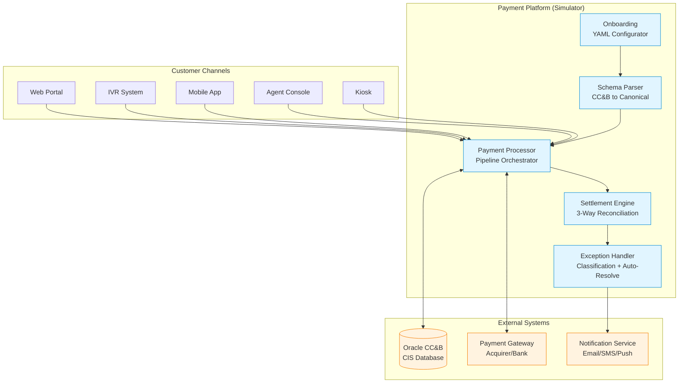
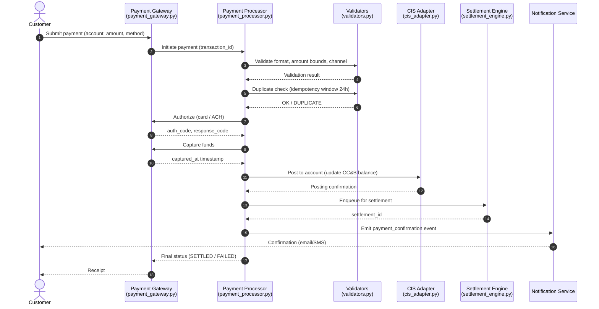
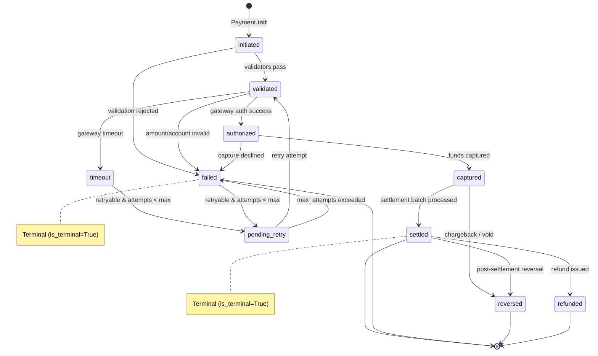
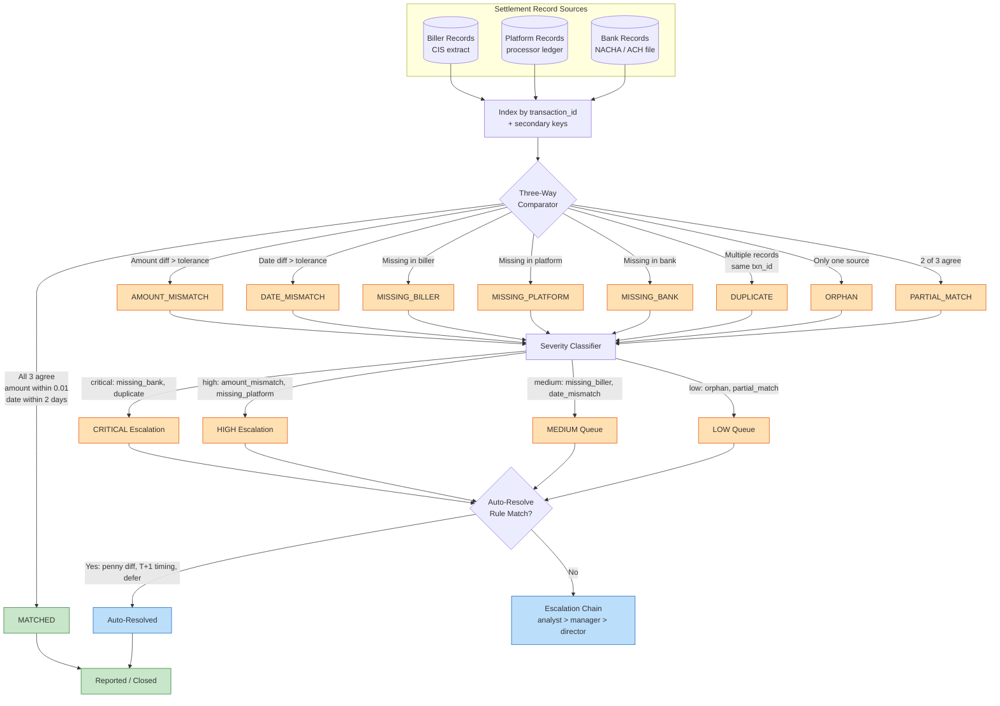

# Architecture Overview

## System Context

The Biller Integration Simulator models the middleware layer between a utility company's Customer Information System (CIS) and a third-party payment acceptance platform. This is the software that answers the question: "How does a customer's online payment get from a web form to reducing their utility bill balance?"

```
┌──────────────┐     ┌─────────────────────┐     ┌──────────────┐
│  Customer    │     │  Payment Platform   │     │  Utility     │
│  Channels    │────>│  (This Simulator)   │────>│  CIS         │
│  (Web/IVR/   │     │                     │     │  (Oracle     │
│   Mobile)    │     │  Onboard -> Process │     │   CC&B)      │
│              │<────│  -> Settle -> Report│<────│              │
└──────────────┘     └─────────┬───────────┘     └──────────────┘
                               │
                    ┌──────────▼───────────┐
                    │  Payment Processor / │
                    │  Acquiring Bank      │
                    └──────────────────────┘
```

### System Architecture (Mermaid)



## Component Architecture

### Layer 1: Models (`src/models/`)

Pure data structures with no external dependencies. These define the vocabulary of the system.

- **oracle_ccb.py**: Mirrors the Oracle CC&B database schema. Field names (`ACCT_ID`, `BILL_STATUS_FLG`, etc.) are intentionally kept identical to the real CC&B data dictionary for clarity.
- **biller.py**: The platform's view of a utility biller — a configuration-driven entity that governs all runtime behavior.
- **payment.py**: Payment transaction lifecycle from initiation through settlement, with full state machine semantics.
- **settlement.py**: Three-way reconciliation data structures including match status, severity, and resolution tracking.

### Layer 2: Core Engines (`src/core/`)

Business logic that operates on the models.

- **onboarding.py**: Reads YAML configuration, validates business rules, and produces Biller instances. This is the "registration" step before a utility can accept payments.
- **schema_parser.py**: Translates between CC&B column names and the platform's canonical fields. Applies transforms (date conversion, flag decoding, zero stripping) during mapping.
- **payment_processor.py**: Orchestrates the payment pipeline: validate → duplicate-check → authorize → capture → settle. Configurable failure rates for realistic simulation.
- **settlement_engine.py**: Three-way reconciliation that compares biller, platform, and bank records. Matches on transaction ID, amount (with tolerance), and date.
- **exception_handler.py**: Classifies, tracks, and (where possible) auto-resolves exceptions using rules from the YAML config.

### Layer 3: Integration (`src/integration/`)

Adapters for external systems (simulated).

- **cis_adapter.py**: Simulates Oracle CC&B web services — account lookup, bill inquiry, payment posting. In production, this would make SOAP or REST calls.
- **payment_gateway.py**: Simulates an acquiring bank / payment processor with realistic response codes, latency, and decline behavior.
- **notification_service.py**: Event-driven notifications (payment confirmation, failure, settlement complete, escalation).

### Layer 4: Utilities (`src/utils/`)

Cross-cutting concerns.

- **validators.py**: Reusable validation functions and a duplicate payment detector.
- **generators.py**: Synthetic data generation for testing. Produces correlated datasets (person → account → SA → bill → payment → settlement).
- **logger.py**: Structured JSON logging with correlation ID context propagation.

## Data Flow

### Payment Processing Flow

```
Customer submits payment
        │
        ▼
┌─────────────────┐
│ Validate         │  Account format, amount bounds, channel eligibility
│ (validators.py)  │
└────────┬────────┘
         │
         ▼
┌─────────────────┐
│ Duplicate Check  │  Idempotency key within 24-hour window
│ (validators.py)  │
└────────┬────────┘
         │
         ▼
┌─────────────────┐
│ Authorize        │  Gateway authorization (simulated)
│ (payment_gw.py)  │
└────────┬────────┘
         │
         ▼
┌─────────────────┐
│ Capture          │  Funds captured
└────────┬────────┘
         │
         ▼
┌─────────────────┐
│ Post to CIS      │  Update account balance in CC&B
│ (cis_adapter.py) │
└────────┬────────┘
         │
         ▼
┌─────────────────┐
│ Settle           │  Move to settlement queue
└─────────────────┘
```

### Settlement Reconciliation Flow

```
┌──────────┐   ┌──────────┐   ┌──────────┐
│ Biller   │   │ Platform │   │  Bank    │
│ Records  │   │ Records  │   │ Records  │
└────┬─────┘   └────┬─────┘   └────┬─────┘
     │              │              │
     └──────────────┼──────────────┘
                    │
                    ▼
          ┌─────────────────┐
          │ Index by TXN ID │
          └────────┬────────┘
                   │
                   ▼
          ┌─────────────────┐
          │ Three-way Match │  Compare: present/absent, amount, date
          └────────┬────────┘
                   │
            ┌──────┼──────┐
            │      │      │
            ▼      ▼      ▼
         MATCHED  MISMATCH MISSING
                   │      │
                   ▼      ▼
          ┌─────────────────┐
          │ Exception Cases │  Classify severity, attempt auto-resolve
          └────────┬────────┘
                   │
                   ▼
          ┌─────────────────┐
          │ Escalation      │  Route to analysts/managers per rules
          └─────────────────┘
```

## Sequence Diagrams

### Payment Processing Sequence

End-to-end interaction starting at the customer channel and finishing with settlement queue handoff.



## State Machines

### PaymentStatus State Machine

The `PaymentStatus` enum (see `src/models/payment.py`) defines ten lifecycle states. Terminal states are `SETTLED`, `FAILED`, `REVERSED`, and `REFUNDED` (per the `is_terminal` property). `FAILED`, `TIMEOUT`, and `PENDING_RETRY` are retryable up to `max_attempts` (default 3).



### Three-Way Settlement Reconciliation

The settlement engine matches the same logical transaction across three independent record sources. Each result is classified into a `MatchStatus` (see `src/models/settlement.py`) and an `ExceptionSeverity`.



## Configuration-Driven Design

The system is designed so that adding a new utility biller requires **zero code changes**. A new YAML entry in `biller_config.yaml` with the biller's payment types, fees, validation rules, and settlement preferences is all that's needed.

Schema mappings between CC&B and the platform are also YAML-driven. When a utility upgrades their CC&B version or changes field conventions, the mapping config is updated rather than the code.

Settlement tolerances, escalation chains, and auto-resolution rules are all externalized in `settlement_rules.yaml`.

## Error Handling Strategy

- **Validation errors**: Rejected at the gate, never enter the processing pipeline. Immediate feedback to the caller.
- **Authorization failures**: Logged, classified, and made available for retry (up to configurable max attempts).
- **Settlement discrepancies**: Classified by severity (critical through low), auto-resolved where rules permit, escalated otherwise.
- **System errors**: Caught at each layer boundary with structured logging. Correlation IDs enable end-to-end tracing.

## Testing Approach

Tests are organized by component:
- `test_onboarding.py`: YAML parsing, validation checks, activation
- `test_schema_parser.py`: Field mapping, transforms, error cases
- `test_payment_processor.py`: Processing pipeline, validation rules, duplicate detection
- `test_settlement.py`: Three-way matching, edge cases, exception creation

Synthetic data generators (`src/utils/generators.py`) produce realistic datasets with configurable anomaly rates, enabling both clean-path and exception-path testing.
