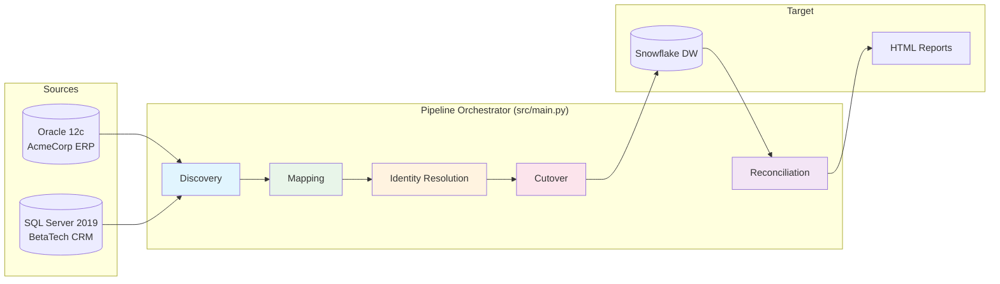
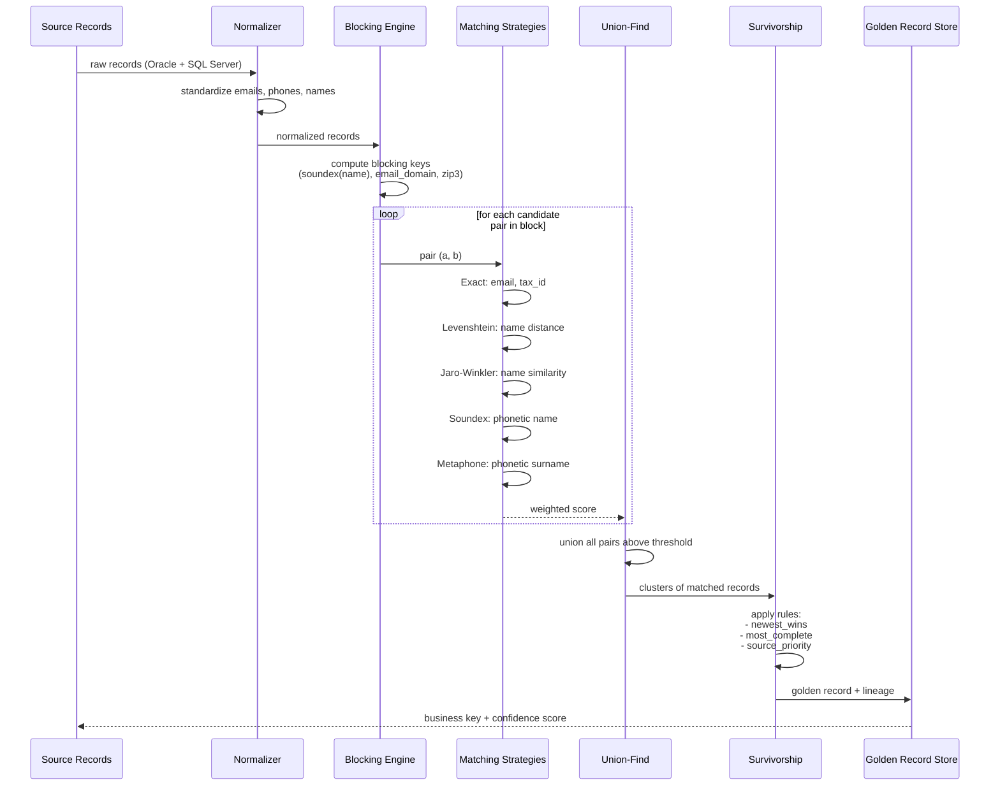
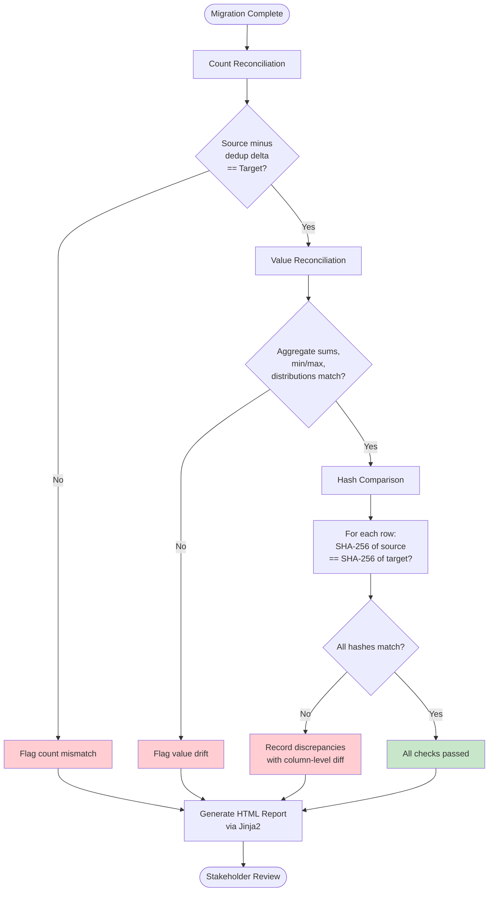
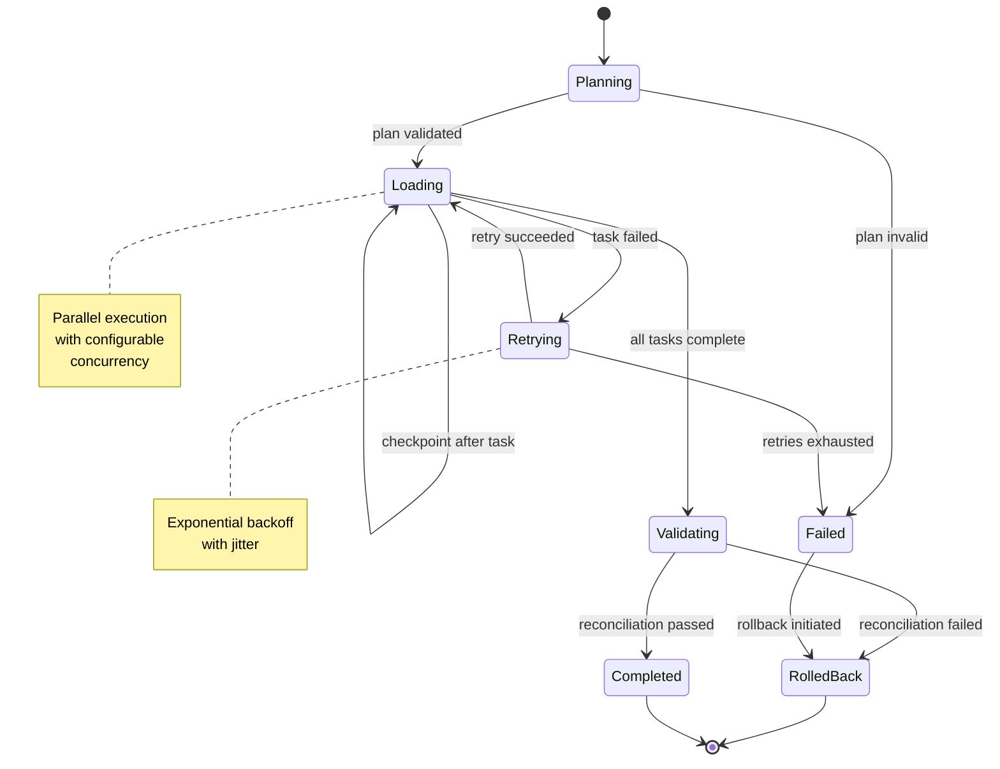

# Architecture

## System Context

This framework is designed for post-acquisition data integration scenarios where two or more legacy source systems must be consolidated into a single enterprise data warehouse. The reference implementation uses:

- **Source A**: Oracle 12c ERP (AcmeCorp -- west-coast division)
- **Source B**: SQL Server 2019 CRM (BetaTech -- east-coast division)
- **Target**: Snowflake Data Warehouse (consolidated enterprise)

## Pipeline Overview



## Component Architecture

```
+---------------------------------------------------------------------------+
|                          Pipeline Orchestrator                             |
|  (src/main.py -- CLI entry point, phase sequencing, metrics collection)   |
+-----------+--------+--------+--------+--------+--------------------------+
            |        |        |        |        |
    +-------v--+ +---v----+ +v------+ +v------+ +v-----------+
    | Discovery| | Mapping| |Identity| |Cutover| |Reconcile   |
    |          | |        | |Resolve | |       | |            |
    +----+-----+ +---+----+ +---+----+ +---+---+ +-----+------+
         |            |          |          |           |
    +----v-----+ +---v----+ +---v----+ +---v---+ +-----v------+
    |Profiler  | |Mapper  | |Dedup   | |Runner | |Count       |
    |Analyzer  | |Xforms  | |Merge   | |Ckpt   | |Value       |
    |Quality   | |Types   | |Match   | |Rollbk | |Hash        |
    |DepMapper | |Validate| |Resolve | |Strategy| |Reports     |
    +----------+ +--------+ +--------+ +-------+ +------------+
         |            |          |          |           |
    +----v------------v----------v----------v-----------v------+
    |                    Utilities Layer                        |
    |  Logger  |  Metrics  |  DB Connector  |  Generators      |
    +----------------------------------------------------------+
```

## Identity Resolution Algorithm



## Reconciliation Validation



## Cutover State Machine



## Data Flow

### Phase 1: Discovery

1. Load source-system YAML metadata
2. Connect to sources (or use synthetic data in demo mode)
3. Profile each table: row counts, column stats, null analysis
4. Score data quality across completeness, uniqueness, validity, consistency
5. Build dependency DAGs from foreign-key metadata
6. Generate proposed column matches via schema analysis

### Phase 2: Schema Mapping

1. Load entity mapping YAML files
2. For each source record, apply the configured transform chain
3. Transforms include: direct copy, concatenation, lookup, type conversion, phone normalization, name extraction, and more (see [transform-operators.md](transform-operators.md))
4. Validate mapping completeness (unmapped source/target columns)

### Phase 3: Identity Resolution

1. Normalize records from all sources into a common comparison schema
2. Build blocking keys to reduce the comparison space
3. Score candidate pairs using configurable weighted strategies:
   - Exact match (email, tax ID)
   - Fuzzy match (Jaro-Winkler on names)
   - Phonetic match (Metaphone on names)
4. Cluster matches using Union-Find
5. Apply survivorship rules to produce golden records
6. Assign business keys and confidence scores

### Phase 4: Cutover

1. Build execution plan (phased or big-bang)
2. Resolve load ordering from dependency DAG
3. Take before-state snapshots for rollback
4. Execute load tasks in parallel within each phase
5. Checkpoint progress after each task
6. On failure: retry with backoff, then rollback if retries exhausted

### Phase 5: Reconciliation

1. Count reconciliation: source total (minus dedup delta) vs target
2. Value reconciliation: aggregate checks (SUM, distribution, range)
3. Hash comparison: SHA-256 fingerprint of each row, matched by key
4. Generate HTML report with summary dashboard and drill-down

## Key Design Patterns

### Strategy Pattern
Used in identity resolution for pluggable matching algorithms. Each `MatchingStrategy` implements a `score(a, b) -> float` interface.

### Union-Find (Disjoint Set)
Used in the dedup engine to efficiently cluster matching records. Path compression and union-by-rank keep operations near O(1) amortized.

### Pipeline Pattern
The orchestrator composes independent phases into a sequential pipeline. Each phase produces structured output consumed by downstream phases.

### Checkpoint/Restart
The `CheckpointManager` persists task states to JSON files. On restart, completed tasks are skipped and failed tasks are retried.

### Configuration as Data
All behavioral rules (mapping transforms, matching thresholds, validation checks) are expressed in YAML rather than hard-coded, enabling configuration-driven changes without code modification.

## Error Handling Strategy

1. **Phase level**: Each phase is wrapped in a `log_phase` context manager that times execution and catches/logs exceptions.
2. **Task level**: Individual load tasks have configurable retry logic with exponential backoff.
3. **Data level**: Transform errors are logged and counted without halting the pipeline (fail-forward for non-critical records).
4. **Recovery**: Checkpoint + rollback enables safe recovery from mid-migration failures.

## Scalability Considerations

- **Blocking keys** in dedup reduce comparisons from O(n^2) to O(n * k) where k is the average block size
- **Parallel load execution** with configurable concurrency
- **Batch processing** support in the dedup engine
- **Streaming-friendly design**: each phase processes records independently, enabling future adaptation to streaming architectures

### Phase 3: Identity Resolution

1. Normalize records from all sources into a common comparison schema
2. Build blocking keys to reduce the comparison space
3. Score candidate pairs using configurable weighted strategies:
   - Exact match (email, tax ID)
   - Fuzzy match (Jaro-Winkler on names)
   - Phonetic match (Metaphone on names)
4. Cluster matches using Union-Find
5. Apply survivorship rules to produce golden records
6. Assign business keys and confidence scores

### Phase 4: Cutover

1. Build execution plan (phased or big-bang)
2. Resolve load ordering from dependency DAG
3. Take before-state snapshots for rollback
4. Execute load tasks in parallel within each phase
5. Checkpoint progress after each task
6. On failure: retry with backoff, then rollback if retries exhausted

### Phase 5: Reconciliation

1. Count reconciliation: source total (minus dedup delta) vs target
2. Value reconciliation: aggregate checks (SUM, distribution, range)
3. Hash comparison: SHA-256 fingerprint of each row, matched by key
4. Generate HTML report with summary dashboard and drill-down

## Key Design Patterns

### Strategy Pattern
Used in identity resolution for pluggable matching algorithms. Each `MatchingStrategy` implements a `score(a, b) -> float` interface.

### Union-Find (Disjoint Set)
Used in the dedup engine to efficiently cluster matching records. Path compression and union-by-rank keep operations near O(1) amortized.

### Pipeline Pattern
The orchestrator composes independent phases into a sequential pipeline. Each phase produces structured output consumed by downstream phases.

### Checkpoint/Restart
The `CheckpointManager` persists task states to JSON files. On restart, completed tasks are skipped and failed tasks are retried.

### Configuration as Data
All behavioral rules (mapping transforms, matching thresholds, validation checks) are expressed in YAML rather than hard-coded, enabling configuration-driven changes without code modification.

## Error Handling Strategy

1. **Phase level**: Each phase is wrapped in a `log_phase` context manager that times execution and catches/logs exceptions.
2. **Task level**: Individual load tasks have configurable retry logic with exponential backoff.
3. **Data level**: Transform errors are logged and counted without halting the pipeline (fail-forward for non-critical records).
4. **Recovery**: Checkpoint + rollback enables safe recovery from mid-migration failures.

## Scalability Considerations

- **Blocking keys** in dedup reduce comparisons from O(n^2) to O(n * k) where k is the average block size
- **Parallel load execution** with configurable concurrency
- **Batch processing** support in the dedup engine
- **Streaming-friendly design**: each phase processes records independently, enabling future adaptation to streaming architectures
