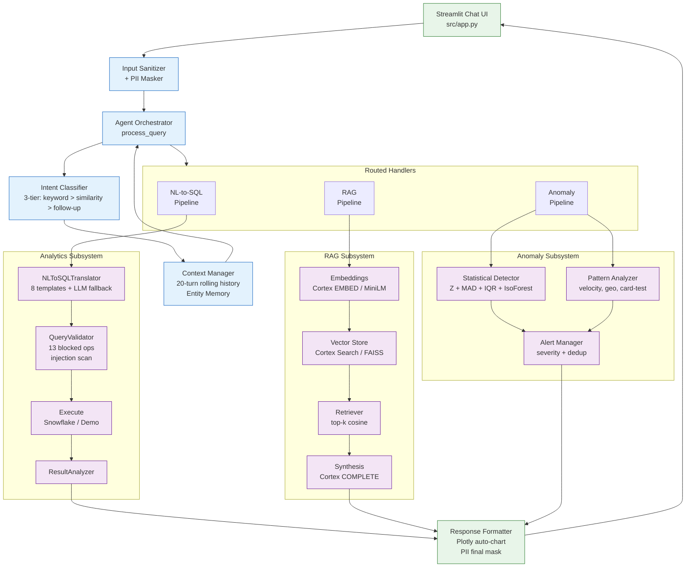
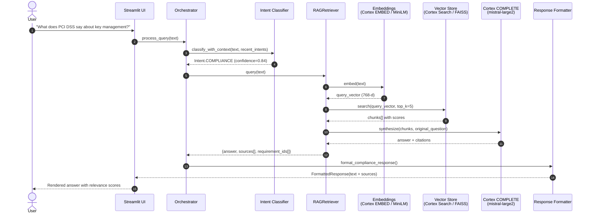
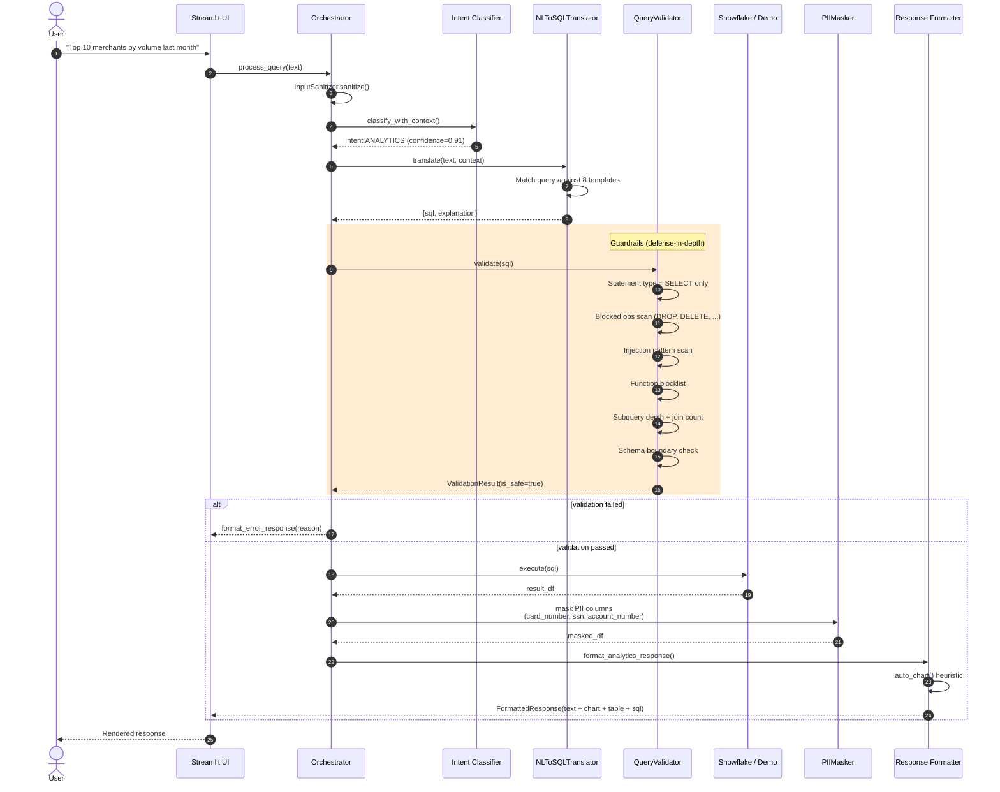
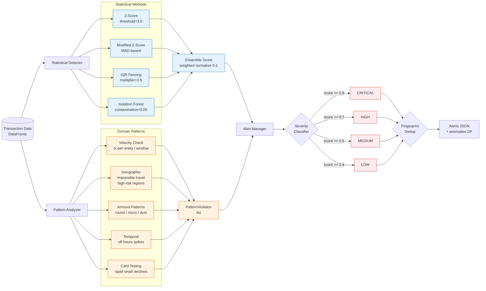

# Payment Intelligence Agent - Architecture

## System Overview

The Payment Intelligence Agent is a Snowflake Cortex-powered conversational system that provides three core capabilities for payment operations teams:

1. **NL-to-SQL Analytics** - Natural language queries translated to Snowflake SQL against payment tables
2. **PCI Compliance RAG** - Retrieval-augmented generation over PCI DSS v4.0 documentation
3. **Anomaly Detection** - Multi-method statistical and pattern-based fraud detection

The system runs as a Streamlit web application with a chat-style interface, supporting both production (Snowflake-connected) and demo (synthetic data) modes.

## Architecture Diagram

```
                    ┌─────────────────────────────┐
                    │     Streamlit Frontend       │
                    │      (Chat Interface)        │
                    └──────────┬──────────────────┘
                               │
                    ┌──────────▼──────────────────┐
                    │   Agent Orchestrator         │
                    │  ┌──────────────────────┐   │
                    │  │  Intent Classifier    │   │
                    │  │  Context Manager      │   │
                    │  │  Response Formatter   │   │
                    │  └──────────────────────┘   │
                    └──┬──────────┬───────────┬───┘
                       │          │           │
           ┌───────────▼──┐ ┌────▼────┐ ┌────▼──────────┐
           │  Analytics   │ │   RAG   │ │   Anomaly     │
           │  Pipeline    │ │Pipeline │ │   Detection   │
           │              │ │         │ │               │
           │ NL-to-SQL    │ │ Loader  │ │ Statistical   │
           │ Validator    │ │ Chunker │ │ Pattern       │
           │ Schema       │ │ Embedder│ │ Alert Manager │
           │ Analyzer     │ │ Vector  │ │               │
           │              │ │ Store   │ │               │
           └──────┬───────┘ └────┬────┘ └───────┬───────┘
                  │              │               │
           ┌──────▼──────────────▼───────────────▼──────┐
           │          Snowflake Platform                 │
           │  ┌─────────┐ ┌──────────┐ ┌─────────────┐ │
           │  │ Payment │ │ Cortex   │ │ Cortex      │ │
           │  │ Tables  │ │ Search   │ │ Complete    │ │
           │  │         │ │ Service  │ │ / Embed     │ │
           │  └─────────┘ └──────────┘ └─────────────┘ │
           └────────────────────────────────────────────┘
```

### Mermaid: Subsystem Routing



### Mermaid: RAG Query Flow



### Mermaid: NL-to-SQL Query Flow



### Mermaid: Anomaly Detection Ensemble



## Component Design

### 1. Agent Layer (`src/agent/`)

#### Orchestrator (`orchestrator.py`)
The central coordination component. Receives user queries, passes them through the intent classifier, routes to the appropriate subsystem, and formats the response.

**Key design decisions:**
- Single entry point (`process_query`) simplifies the Streamlit integration
- Lazy initialization of subsystems (RAG is only loaded when first needed)
- PII masking applied to all outbound data as a final safety layer

#### Intent Classifier (`intent_classifier.py`)
Three-tier classification approach:
1. **Keyword matching** (fastest) - deterministic routing for clear queries
2. **Example similarity** - Jaccard similarity against labeled examples
3. **Context-aware boosting** - follow-up detection using conversation history

This avoids the latency and cost of LLM-based classification for the 80%+ of queries that are clearly identifiable by keywords.

#### Context Manager (`context_manager.py`)
Maintains conversation state across turns:
- Rolling history window with configurable size
- Entity memory for resolving references ("those merchants", "same period")
- Session timeout for automatic cleanup

#### Response Formatter (`response_formatter.py`)
Transforms raw results into rich responses:
- Auto-detects appropriate chart types from data shape and query keywords
- Formats compliance answers with source attribution
- Renders anomaly alerts with severity-colored indicators

### 2. Analytics Layer (`src/analytics/`)

#### NL-to-SQL Translator (`nl_to_sql.py`)
Template-based translation with fallback construction:
- 8 pre-built query templates covering common payment analytics patterns
- Regex-based intent matching routes queries to templates
- Time range extraction handles relative dates ("last month", "past 7 days")
- Generic query construction for unmatched patterns

**Why templates over pure LLM generation:** Templates provide predictable, validated SQL with zero latency. The LLM fallback handles edge cases when available.

#### Query Validator (`query_validator.py`)
Defense-in-depth SQL validation:
1. Statement type check (SELECT only)
2. Blocked operation detection
3. Injection pattern scanning
4. Function blocklist
5. Subquery depth limiting
6. Join count limiting
7. Schema boundary verification

#### Schema Introspector (`schema_introspector.py`)
Provides schema context for SQL generation. In demo mode, returns a comprehensive predefined schema. In production, queries INFORMATION_SCHEMA.

### 3. RAG Layer (`src/rag/`)

#### Document Pipeline
```
Markdown Files → DocumentLoader → DocumentChunker → EmbeddingGenerator → VectorStore
                 (sections)       (overlap chunks)   (MiniLM / Cortex)   (FAISS)
```

#### Chunking Strategy
Section-aware chunking preserves semantic coherence:
1. Split on markdown headings (section boundaries)
2. Split oversized sections on paragraph boundaries
3. Split oversized paragraphs on sentence boundaries
4. Apply configurable character overlap between consecutive chunks

#### Embedding
Dual-mode embedding:
- **Production**: Snowflake Cortex `EMBED` function with `e5-base-v2`
- **Demo**: `sentence-transformers/all-MiniLM-L6-v2` (local) with deterministic hash fallback

#### Vector Store
FAISS-backed in-memory store with cosine similarity. In production, this is replaced by Snowflake Cortex Search service through the same interface.

### 4. Anomaly Detection Layer (`src/anomaly/`)

#### Statistical Detector (`statistical.py`)
Ensemble approach combining multiple methods:
- **Z-score**: Standard deviation-based, good for normally distributed data
- **Modified Z-score (MAD)**: Robust to outliers, uses median absolute deviation
- **IQR fencing**: Non-parametric, effective for skewed distributions
- **Isolation Forest**: Tree-based unsupervised detection

Composite scores are normalized to [0, 1] using weighted averaging.

#### Pattern Analyzer (`pattern_analyzer.py`)
Domain-specific payment fraud patterns:
- **Velocity checks**: Excessive transactions per entity per time window
- **Geographic anomalies**: High-risk region concentration, impossible travel
- **Amount patterns**: Round amounts, micro-transactions (card testing)
- **Temporal patterns**: Off-hours activity spikes
- **Card testing**: Rapid small-amount declines

#### Alert Manager (`alert_manager.py`)
Lifecycle management for detection alerts:
- Severity classification (critical/high/medium/low)
- Fingerprint-based deduplication to prevent alert fatigue
- Acknowledgment tracking
- Summary aggregation by severity and category

## Data Model

Five core tables form the payment processing data model:

| Table | Description | Key Relationships |
|-------|-------------|-------------------|
| TRANSACTIONS | Core payment records | FK to MERCHANTS, CUSTOMERS |
| MERCHANTS | Merchant profiles with risk tiers | Referenced by TRANSACTIONS, SETTLEMENTS, CHARGEBACKS |
| CUSTOMERS | Customer profiles (PII-minimized) | Referenced by TRANSACTIONS |
| SETTLEMENTS | Batch settlement records | FK to MERCHANTS |
| CHARGEBACKS | Dispute records | FK to TRANSACTIONS, MERCHANTS |

## Security Model

### Input Sanitization
- HTML stripping via `bleach`
- Length enforcement
- SQL injection pattern detection (8 regex patterns)
- Identifier sanitization for SQL construction

### PII Protection
- 7 PII patterns (credit cards, SSNs, emails, phones, CVVs, account/routing numbers)
- Recursive masking for nested data structures
- Applied at the response formatting layer as a final safety net

### Query Safety
- Whitelist-only statement types (SELECT, WITH)
- 13 blocked SQL operations
- 8 blocked dangerous functions
- Subquery depth and join count limits

## Deployment Modes

### Demo Mode (Default)
- No Snowflake connection required
- Synthetic data generated in-memory
- Local embedding model (or hash fallback)
- FAISS vector store
- Full pipeline functional for testing and demonstration

### Production Mode
- Snowflake connector with connection pooling
- Cortex COMPLETE for LLM inference
- Cortex EMBED for embedding generation
- Cortex Search Service for RAG retrieval
- Role-based access via PAYMENT_ANALYST role

## Technology Stack

| Component | Technology |
|-----------|------------|
| Frontend | Streamlit |
| LLM | Snowflake Cortex (mistral-large2) |
| Embeddings | Cortex EMBED / sentence-transformers |
| Vector Search | FAISS / Cortex Search |
| Visualization | Plotly |
| SQL Parsing | sqlparse |
| Data Processing | pandas, numpy, scipy |
| ML | scikit-learn (Isolation Forest) |
| Logging | structlog |
